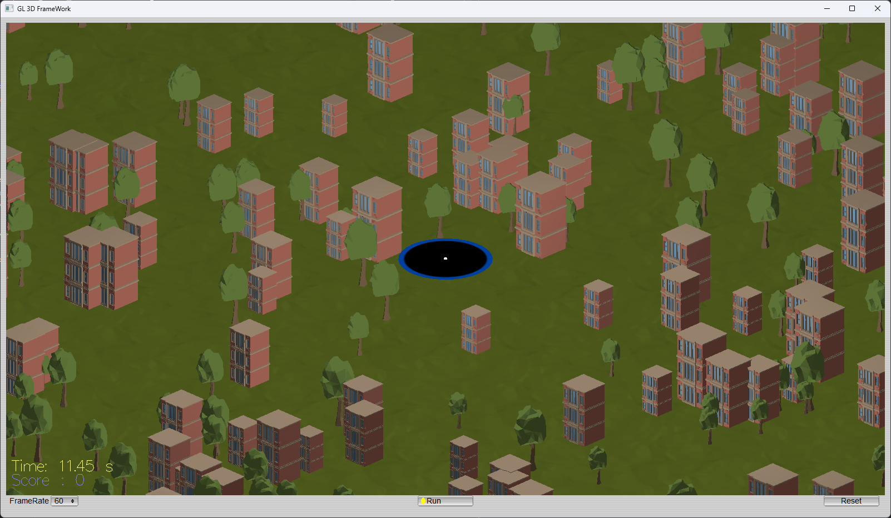
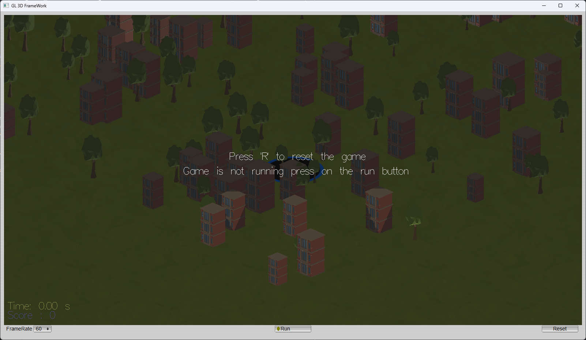
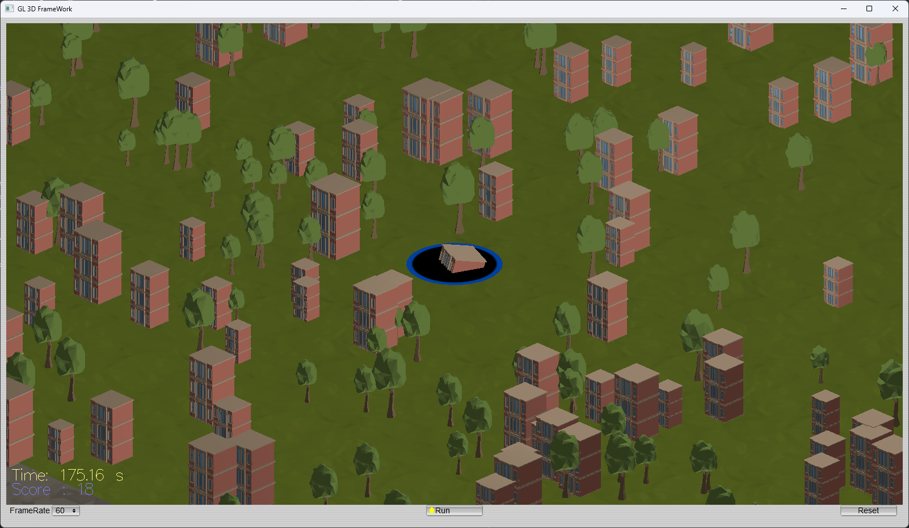
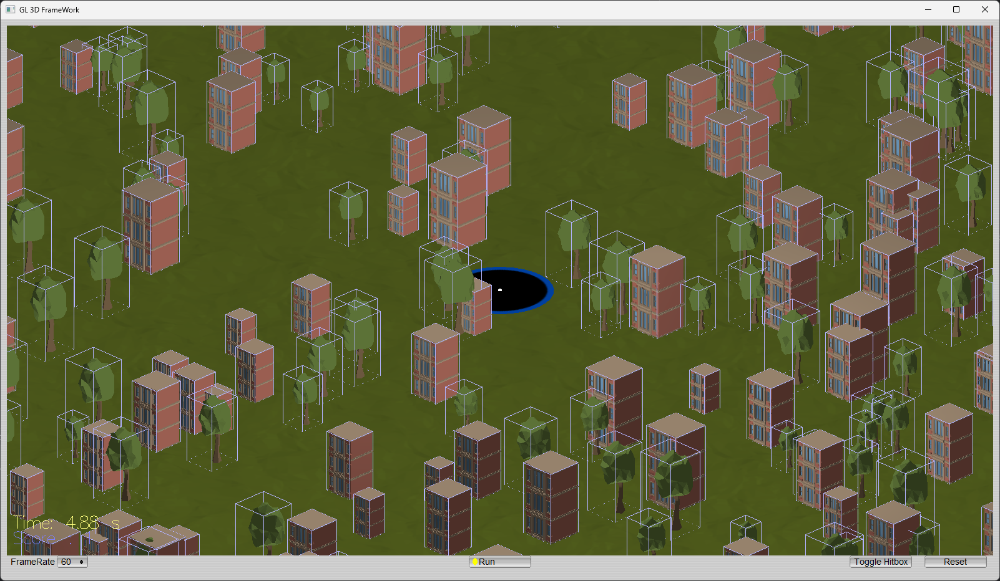

# 🕳️ Hole Controlled on a 3D Map: A Physics-Based Game



## Overview

**Hole Controlled on a 3D Map** is a real-time 3D physics-based game where you control a mobile hole that swallows objects in its environment. As you consume more objects, your hole grows, unlocking new challenges and interactions. The game is built with C++, OpenGL, and FLTK, featuring realistic physics, interactive gameplay, and a modular codebase.

---

## 🚀 Features
- **Real-time WASD control** of the player-controlled hole
- **Swallowing mechanic:** objects are pulled in and removed when overlapping the hole
- **Growth system:** the hole grows as it swallows objects
- **Physics simulation:** objects have mass, friction, and realistic collision response
- **Timer and score system**
- **UI controls:** Run, Reset, and Toggle Hitbox buttons
- **Hitbox visualization:** toggle hitbox rendering for debugging
- **Beautiful 3D models and textures**

---

## 🖥️ Screenshots

| First Launch | Play Game |
|:---:|:---:|
|  |  |
| Building Swallowed | Hitbox Visualization |
|  |  |

---

## 🛠️ Build Instructions

### Prerequisites
- C++17 compatible compiler
- [CMake](https://cmake.org/) (>=3.15)
- [vcpkg](https://github.com/microsoft/vcpkg) (for dependencies)
- OpenGL, FLTK, and GLEW (handled by vcpkg)

### Build Steps
```bash
# Clone the repository
$ git clone https://github.com/AlexandreDFM/ComputerGraphics_physical_finalProject.git
$ cd ComputerGraphics_physical_finalProject

# Install dependencies (using vcpkg)
$ vcpkg install fltk glew

# Configure and build
$ cmake -B build -S . -DCMAKE_TOOLCHAIN_FILE=path/to/vcpkg/scripts/buildsystems/vcpkg.cmake
$ cmake --build build
```

> **Note:** Adjust the vcpkg path as needed for your system.

---

## 🎮 Usage & Controls
- **WASD:** Move the hole
- **Run:** Start/stop the simulation
- **Reset:** Restart the game
- **Toggle Hitbox:** Show/hide hitboxes for debugging

---

## 📁 Project Structure
```
assets/           # Images and textures
Cyclone/          # Physics engine code
final_project/    # Main game source code
Models/           # 3D models
```

---

## 👨‍💻 Authors
- Hippolyte Ferdinand Joseph Aubert
- Alexandre Kevin De Freitas Martins

Department of Game Software, Keimyung University  
[Project Repository](https://github.com/AlexandreDFM/ComputerGraphics_physical_finalProject)

---

## 📜 License
This project is licensed under the MIT License. See [LICENSE](LICENSE) for details.
